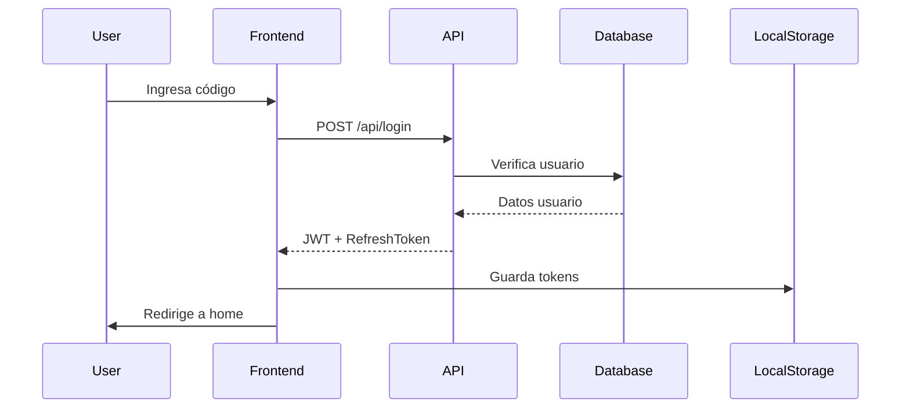
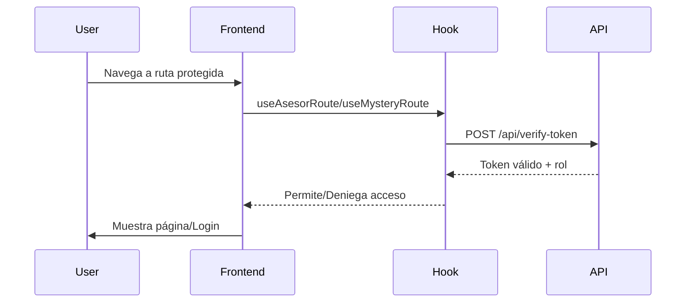
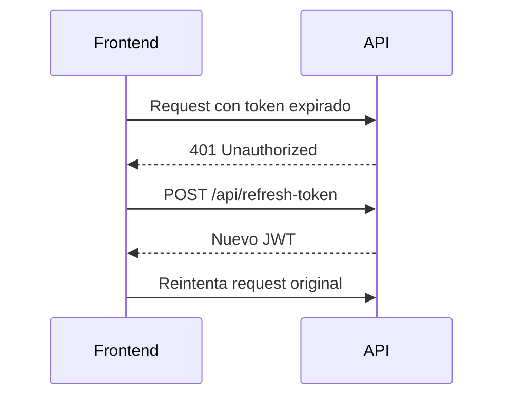

# Autenticación y Roles - Sistema Terpel

## Visión General

El sistema implementa autenticación basada en JWT (JSON Web Tokens) con protección de rutas por roles. Solo existen dos roles activos: **Asesor** y **Mystery Shopper**.

## Arquitectura de Autenticación

### Backend (API)

#### Endpoints de Autenticación

**POST /api/login**
```javascript
// Request
{
  "codigo": "string" // Código del usuario
}

// Response (éxito)
{
  "success": true,
  "token": "jwt_token",
  "refreshToken": "refresh_token",
  "user": {
    "id": "number",
    "codigo": "string",
    "nombre": "string",
    "rol": "asesor|mysteryshopper"
  }
}
```

**POST /api/verify-token**
```javascript
// Request
{
  "token": "jwt_token"
}

// Response
{
  "valid": true,
  "user": { /* datos del usuario */ }
}
```

**POST /api/refresh-token**
```javascript
// Request
{
  "refreshToken": "refresh_token"
}

// Response
{
  "token": "new_jwt_token"
}
```

**POST /api/logout**
```javascript
// Request
{
  "token": "jwt_token"
}
```

#### Middleware de Protección

**`authenticateToken`** - Verifica JWT válido
```javascript
// Ubicación: Api/routes/auth.js
const authenticateToken = (req, res, next) => {
  // Extrae token del header Authorization
  // Verifica validez del token
  // Agrega user al req.user
  // Continúa o retorna error 401/403
}
```

**`requireRole(roles)`** - Verifica rol específico
```javascript
// Uso en rutas
app.get('/api/historial-registros/:user_id', 
  authenticateToken, 
  requireRole(['asesor']), 
  handler
);
```

### Frontend (React)

#### Context de Autenticación

**`AuthContext`** - Estado global de autenticación
```javascript
// Ubicación: src/contexts/AuthContext.jsx
const AuthContext = {
  user: null,           // Datos del usuario autenticado
  token: null,          // JWT token actual
  login: Function,      // Función de login
  logout: Function,     // Función de logout
  isLoading: boolean    // Estado de carga
}
```

#### Hooks de Autenticación

**`useAuth`** - Hook principal
```javascript
// Ubicación: src/hooks/auth/useAuth.js
const { user, token, login, logout, isLoading } = useAuth();
```

**`useAuthGuard`** - Protección de rutas
```javascript
// Ubicación: src/hooks/auth/useAuthGuard.js
const { isAuthenticated, checkingAuth } = useAuthGuard();
```

**Hooks de Protección por Rol:**
```javascript
// src/hooks/auth/useProtectedRoute.js
const useAsesorRoute = () => useProtectedRoute(['asesor']);
const useMysteryRoute = () => useProtectedRoute(['mysteryshopper']);
```

## Flujo de Autenticación

### 1. Login


### 2. Verificación de Rutas


### 3. Renovación de Token


## Implementación en Componentes

### Protección de Rutas
```javascript
// App.jsx
function App() {
  return (
    <AuthProvider>
      <Routes>
        <Route path="/login" element={<Login />} />
        <Route path="/asesor/*" element={
          <ProtectedRoute roles={['asesor']}>
            <AsesorRoutes />
          </ProtectedRoute>
        } />
        <Route path="/mystery/*" element={
          <ProtectedRoute roles={['mysteryshopper']}>
            <MysteryRoutes />
          </ProtectedRoute>
        } />
      </Routes>
    </AuthProvider>
  );
}
```

### Uso en Componentes
```javascript
// Cualquier componente
import { useAuth } from '../hooks/auth';

function MiComponente() {
  const { user, logout } = useAuth();
  
  // Mostrar info del usuario
  // Botón de logout
  
  return (
    <div>
      <span>Bienvenido {user?.nombre}</span>
      <button onClick={logout}>Cerrar Sesión</button>
    </div>
  );
}
```

### Protección de Páginas Específicas
```javascript
// pages/Asesor/Home.jsx
import { useAsesorRoute } from '../../hooks/auth';

function AsesorHome() {
  const { loading, user } = useAsesorRoute();
  
  if (loading) return <div>Cargando...</div>;
  
  // Página solo visible para asesores
  return <div>Panel de Asesor</div>;
}
```

## Configuración de Tokens

### JWT Settings
```javascript
// Backend - server.js
const JWT_SECRET = process.env.JWT_SECRET || 'fallback_secret';
const JWT_EXPIRATION = '1h';          // Token expira en 1 hora
const REFRESH_EXPIRATION = '7d';      // Refresh token expira en 7 días
```

### Token Storage
```javascript
// Frontend - localStorage
localStorage.setItem('token', jwt_token);
localStorage.setItem('refreshToken', refresh_token);
localStorage.setItem('user', JSON.stringify(user_data));
```

## Roles y Permisos

### Asesor
- **Rutas permitidas:** `/asesor/*`
- **Funcionalidades:**
  - Registrar actividades
  - Ver historial personal
  - Acceder catálogos
  - Subir evidencias

### Mystery Shopper
- **Rutas permitidas:** `/mystery/*`
- **Funcionalidades:**
  - Realizar evaluaciones
  - Generar reportes
  - Subir evidencias de evaluación

## Manejo de Errores

### Códigos de Estado
- **401 Unauthorized:** Token inválido o expirado
- **403 Forbidden:** Usuario sin permisos para el recurso
- **404 Not Found:** Recurso no existe
- **500 Internal Error:** Error del servidor

### Respuestas de Error
```javascript
// Formato estándar de errores
{
  "success": false,
  "message": "Descripción del error",
  "code": "ERROR_CODE",
  "details": {} // Información adicional si aplica
}
```

## Seguridad

### Mejores Prácticas Implementadas
1. **Tokens con expiración corta** (1 hora)
2. **Refresh tokens para renovación** (7 días)
3. **Validación en cada request protegido**
4. **Limpieza de tokens en logout**
5. **Verificación de roles en backend**
6. **Headers seguros en API**

### Consideraciones de Seguridad
- Los tokens se almacenan en localStorage (considerar httpOnly cookies para mayor seguridad)
- Implementar rate limiting en endpoints de autenticación
- Considerar 2FA para usuarios administradores
- Logs de auditoría para accesos sensibles

---

**Actualizado:** Enero 2025
